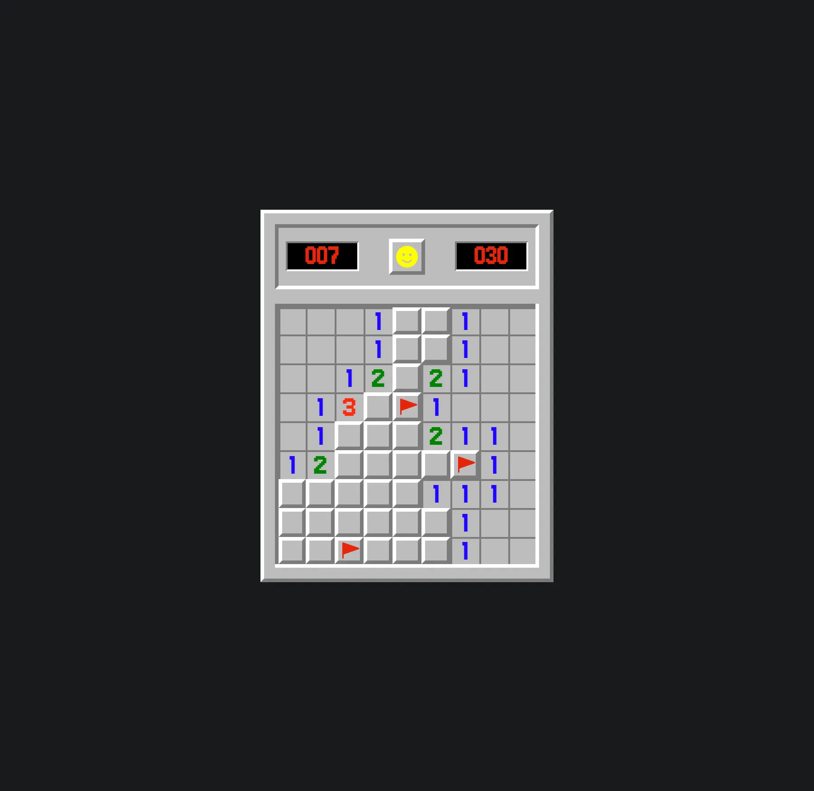
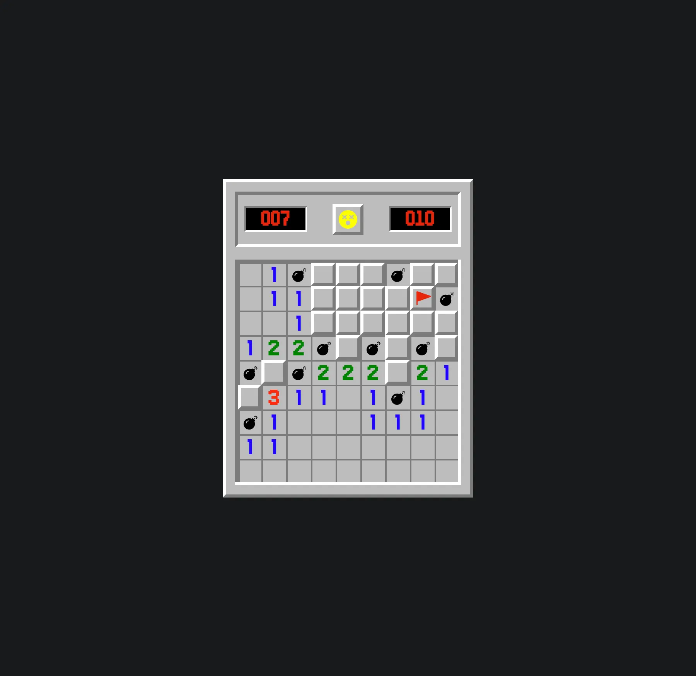

# Minesweeper 🎮

A modern implementation of the classic **Minesweeper** game built with **React 19**, **TypeScript**, **Tailwind CSS**, and **Vite**.

## 🚀 Features

- ⚛️ React 19 + TypeScript
- 🎨 Tailwind CSS for styling
- 🧠 Global state with Zustand
- ⏱️ Timer with `react-timer-hook`
- 🔊 Sound effects via Howler.js
- 🎉 Confetti celebration using `react-confetti`
- ⚡ Instant dev/build with Vite
- ✅ Strict linting, formatting, testing, and pre-commit checks

---

## 📦 Tech Stack

- **React**, **ReactDOM**
- **TypeScript**
- **Vite**
- **Tailwind CSS**
- **Zustand**
- **Howler.js**
- **Vitest**
- **Prettier**, **ESLint**, **Husky**

---

## 🛠️ Scripts

| Script           | Description                                      |
|------------------|--------------------------------------------------|
| `dev`            | Start dev server                                 |
| `dev:host`       | Serve locally and over LAN                       |
| `build`          | Type-check and create production build           |
| `preview`        | Preview the built app                            |
| `lint`           | Run ESLint                                       |
| `format`         | Format files using Prettier                      |
| `test`           | Run all tests                                    |
| `test:watch`     | Run tests in watch mode                          |
| `test:coverage`  | Generate coverage report                         |
| `prepare`        | Setup Git hooks with Husky                       |
| `pre-commit`     | Run lint + tests before commit                   |

---

## 🧪 Testing

```bash
pnpm test            # Run all tests
pnpm test:watch      # Run tests in watch mode
pnpm test:coverage   # Coverage report
```

---

## 🧷 Linting & Formatting

```bash
pnpm lint      # ESLint
pnpm format    # Prettier
```

Pre-commit hooks ensure lint and test checks before each commit.

---

## 🖼️ Image Demonstrations

Here are some screenshots demonstrating the gameplay:

### Menu


### Game Board


### Loss screen



---

## 🧩 Project Structure

```
src/
├── app/
│   ├── App.tsx          # Root component
│   ├── main.tsx         # Entry point
│   ├── components/      # Game-specific components (e.g. Board, Cell)
│   ├── hooks/           # Custom hooks
│   └── utils/           # Local game utilities
├── configs/
│   └── game-difficulties.ts  # Preset difficulty settings
├── store/              # Global Zustand state
├── styles/             # Tailwind and global styles
├── types/              # Shared TypeScript types
├── ui/                 # Reusable UI components (e.g. Button, Modal)
└── utils/              # General-purpose utilities
```

---

## 📄 Commit Guidelines

This project follows [Conventional Commits](https://www.conventionalcommits.org/en/v1.0.0/).

Example commit messages:

```
feat: add support for Expert difficulty  
fix: correct timer reset behavior  
```

---

## ▶️ Getting Started

```bash
pnpm install    # Install dependencies
pnpm dev        # Start development server
```


---

## 📄 License

MIT 
